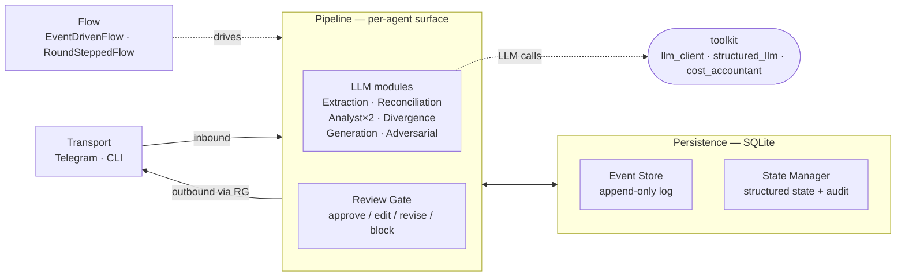
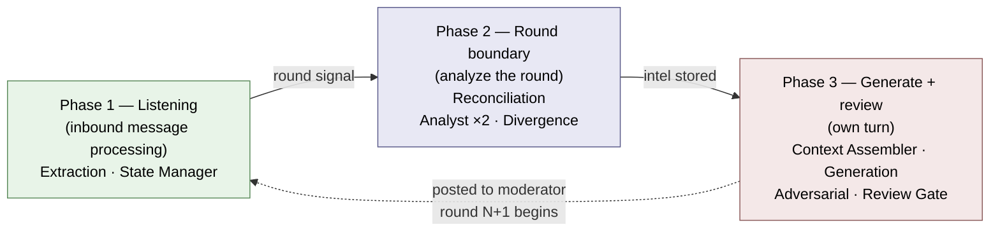
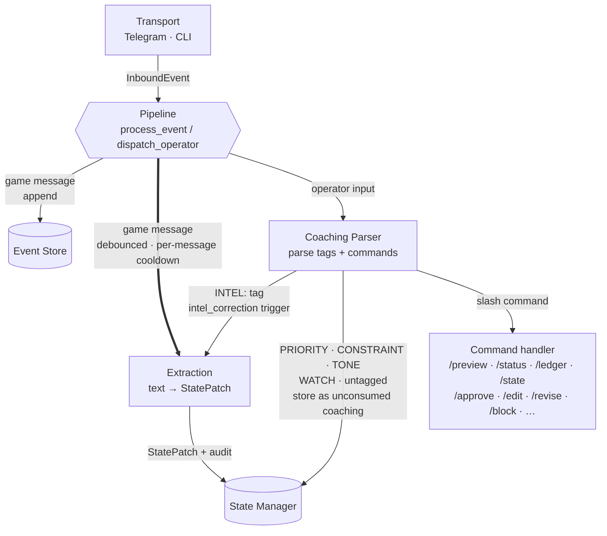
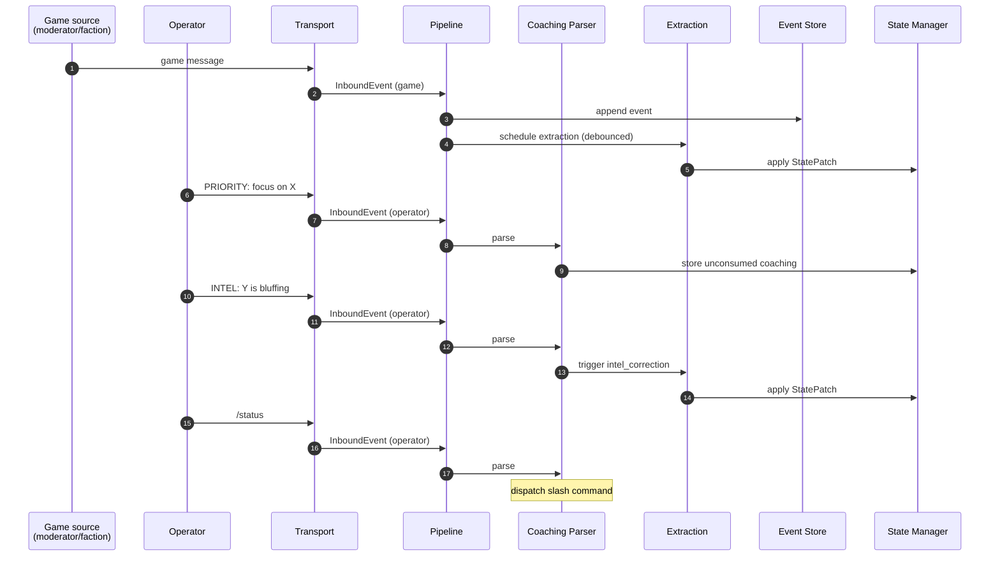
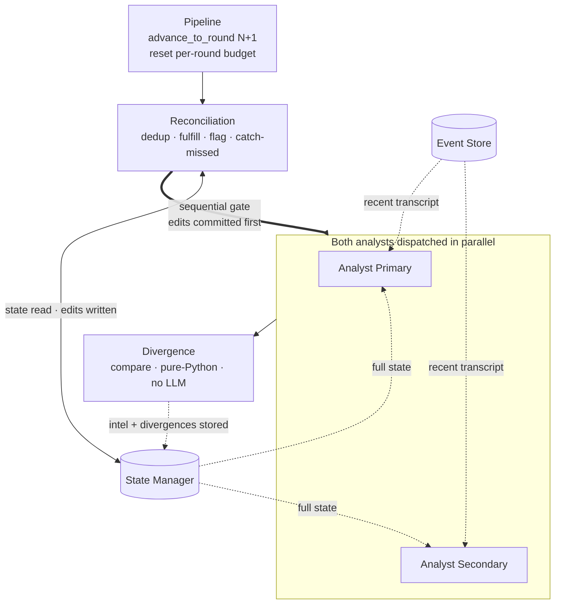
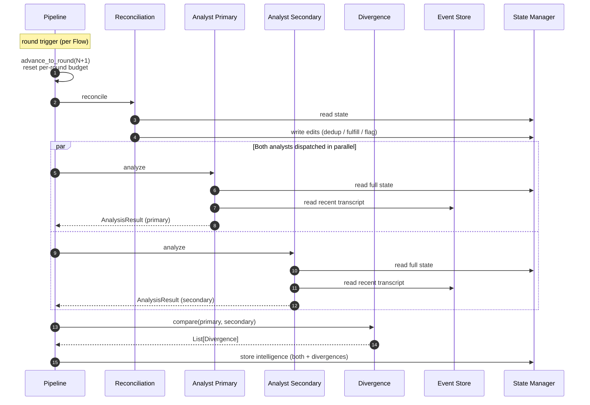
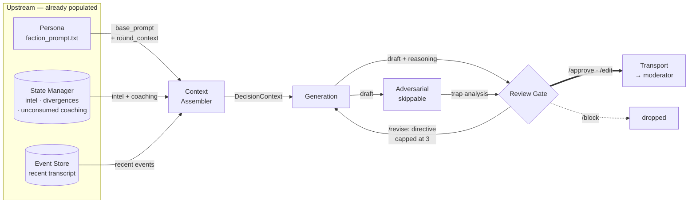
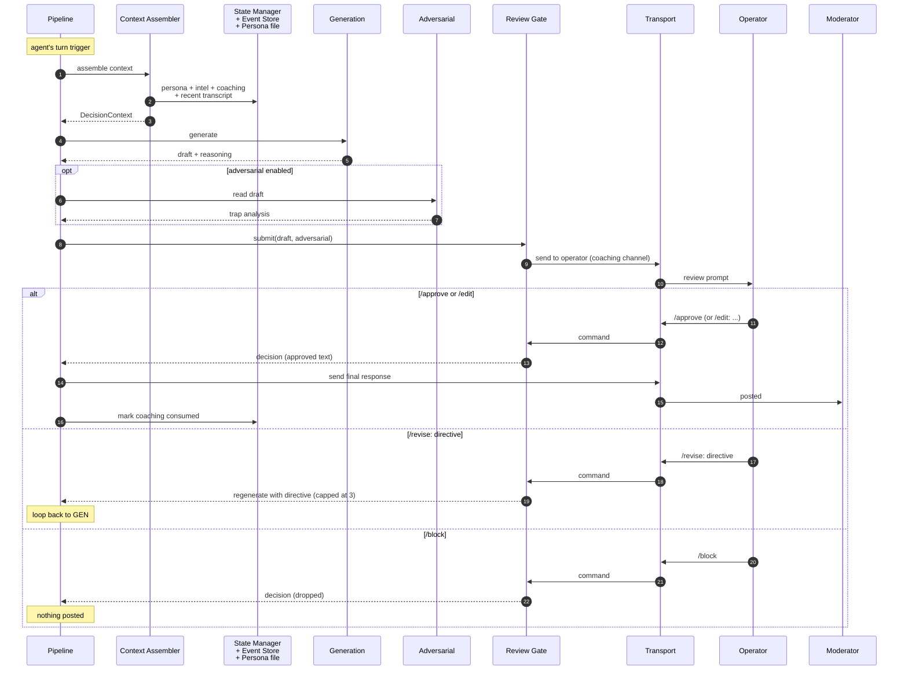

# Diplomat — Architecture Diagrams

Layered architecture diagrams. Read top-down: overview first, then drill into the
concern you care about. Render with the `render_mermaid_file` tool, or with the
VSCode `Markdown Preview Mermaid Support` extension (`bierner.markdown-mermaid`).

---

## Overview

Five logical groupings. Click any node to jump to its detailed architecture doc.

### What this view shows

- **Flow drives Pipeline** — the architectural lever that makes production vs
  benchmark cheap. `EventDrivenFlow` for live Telegram games; `RoundSteppedFlow`
  for self-play benchmarking. Same per-agent capability surface underneath.
- **Pipeline owns the LLM modules and the Review Gate** — every per-agent
  capability hangs off Pipeline.
- **Persistence is two files of one SQLite database** — Event Store
  (append-only log) and State Manager (structured state + audit) own separate
  tables but live in one file.
- **Transport is the only I/O** — Telegram in production, CLI in benchmark.
- **toolkit is the only external dependency** for LLM concerns. All LLM
  modules go through `toolkit/structured_llm` (which in turn uses
  `llm_client` + `cost_accountant`).

### Not shown

| Concern | Where to find it |
|---|---|
| Internal LLM module relationships (Analyst×2 → Divergence, Generation → Adversarial → Review Gate) | Drill-down: round boundary + response pipeline below |
| Coaching Parser, Persona, Context Assembler | Drill-down: inbound processing (Coaching Parser) + response pipeline (Persona, Context Assembler) below |
| Round-boundary sequence (Reconciliation → Analyst → Divergence → intel store) | Drill-down: round boundary below |
| Inbound message routing (extraction debouncing, INTEL routing) | Drill-down: inbound processing below |
| Operator command surface (slash commands, tag routing) | Drill-down: inbound processing below |
| Edit Classifier wiring | `ARCH_edit_classifier.md` |
| Scenario Compiler / Scenario Builder | `ARCH_*.md` for each — pre-game tools, not pipeline modules |
| What runs when (temporal view) | Lifecycle diagram below |

---

## Lifecycle

What happens during a game turn, **per agent**. Three phases in a cycle. Module
activation is the same under both `EventDrivenFlow` and `RoundSteppedFlow` —
only the trigger differs (table below).

### What each phase does

- **Phase 1 — Listening.** Every inbound message (faction speech, moderator,
  operator) is appended to Event Store and routed. Game messages trigger
  debounced Extraction → StatePatch → State Manager. `INTEL:` operator tags
  trigger immediate Extraction with `intel_correction`. Other operator tags
  become unconsumed coaching on State Manager.
- **Phase 2 — Round boundary.** Reconciliation passes over the round's state
  changes (dedup promises, detect fulfillments, flag inconsistencies). Then
  both Analysts read full state + recent transcript in parallel; Divergence
  compares their outputs. Intel + divergences land on State Manager for use
  in Phase 3.
- **Phase 3 — Generate + review.** Triggered on the agent's own turn. Runs the
  response pipeline (see drill-down below): Context Assembler → Generation →
  Adversarial → Review Gate → Transport. After posting, unconsumed coaching
  is marked consumed.

### Trigger differences

| Phase | EventDrivenFlow (production) | RoundSteppedFlow (self-play) |
|---|---|---|
| 1 — Listening | `Transport.listen()` fires on each inbound | Collected messages flushed at step boundary |
| 2 — Round boundary | round_signal message from moderator | End-of-round (all factions have spoken) |
| 3 — Generate + review | Agent's turn signal in the chat | `round_step()` iterates over factions |

### Multi-agent fan-out

- **RoundSteppedFlow** drives N Pipelines (one per faction), each with its own
  Event Store + State Manager file. The cycle runs per faction; Phase 3
  iteration is sequential across factions within a round.
- **EventDrivenFlow** typically drives one Pipeline — the bot is a single
  faction among human players in the same Telegram chat. The cycle runs only
  for the bot's Pipeline.

### Not shown

| Concern | Where to find it |
|---|---|
| Per-phase message sequence (who sends what to whom) | Per-phase sequence diagrams in each drill-down below |
| Operator command interleaving during Phase 1 | Drill-down: inbound processing below |
| Extraction debounce / per-message cooldown | Drill-down: inbound processing below |
| Cost accountant per-round budget reset (happens at Phase 2 entry) | `ARCH_orchestrator.md` |

---

## Inbound processing

What happens to every message arriving at the agent, **per agent**. Covers both
game messages (from moderator + other factions) and operator input (tagged
coaching, INTEL corrections, slash commands).

### What this view shows

- **Two destinations for every game message** (fan-out at Pipeline): append to
  Event Store *and* schedule Extraction. Both happen for the same inbound.
- **Debounce on game-message Extraction.** Per-message cooldown: each new game
  message cancels the pending extraction task and replaces it. Extraction
  runs once per burst, not once per message. Bold edge marks the debounced
  path.
- **Operator input is parsed by tag**, three destinations:
  - `INTEL: …` routes to Extraction with the `intel_correction` trigger (no
    debounce — operator intent is treated as direct).
  - Other tags + untagged text → stored as unconsumed coaching on State
    Manager, awaiting the next Phase 3 (Context Assembler reads it).
  - Slash commands → command handler. Review-gate commands (`/approve`,
    `/edit`, `/revise`, `/block`) route through `Pipeline.dispatch_operator`
    → `ReviewGate.handle_command` and are how Phase 3 advances.
- **Asymmetric Event Store write:** game messages append; operator messages
  do not. The Event Store is a game-state log, not an audit of operator
  interaction (operator interactions show up in State Manager via coaching
  table and edit-log instead).

### Sequence

Time order for one representative round opener: a game message, a `PRIORITY:`
tag, an `INTEL:` correction, and a `/status` command.

### Not shown

| Concern | Where to find it |
|---|---|
| Extraction's JSON schema enforcement + retry | `ARCH_extraction.md` |
| Cost accountant budget gating on the Extraction LLM call | `ARCHITECTURE.md` § Coupling Notes — `DiplomatCostGate` |
| How Flow drives `Transport.listen()` vs. `round_step()` | Lifecycle above — trigger-differences table |
| What "unconsumed coaching" looks like once accumulated | Response pipeline below — Context Assembler input |
| Edit Classifier post-hook (fires when `/edit` completes) | `ARCH_edit_classifier.md` |
| Coaching Parser is a toolkit primitive (`toolkit.coaching`) | `ARCHITECTURE.md` § Implementation Sequence |

---

## Round boundary

What runs between rounds, **per agent**. Triggered by `Pipeline.advance_to_round(N+1)`
(triggers per Flow — see Lifecycle's trigger-differences table above).

### What this view shows

- **Sequential gate before the parallel fan-out.** Reconciliation completes
  and commits its edits to State Manager *before* either Analyst starts, so
  both Analysts read post-reconciled state. Bold edge marks the gate.
- **Two Analysts dispatched in parallel.** Same inputs (full state + recent
  transcript), different LLM providers. The duality is what makes Divergence
  meaningful — it's a cross-provider sanity check on intel quality.
- **Divergence is pure-Python.** No LLM call, no toolkit dependency. It
  compares the two `AnalysisResult` objects against configurable thresholds
  and emits a `List[Divergence]`.
- **Per-round budget reset happens here**, at boundary entry, before any LLM
  call. A round-blowing call in the previous round does not leak into the
  next round's budget.

### Sequence

Time order between rounds. Shows the sequential gate (Reconciliation commits
edits before Analysts read) and the parallel analyst dispatch.

### Not shown

| Concern | Where to find it |
|---|---|
| Per-call cost-accountant budget gating (every LLM call is checked against `available_budget()`) | `ARCHITECTURE.md` § Coupling Notes — `DiplomatCostGate` |
| Divergence thresholds (configurable in `pipeline.yaml`) | `ARCH_analyst.md` |
| Reconciliation prompt structure + categories of edits | `ARCH_reconciliation.md` |
| How the round signal is detected (per-Flow) | Lifecycle above — trigger-differences table |
| What Phase 3 does with the stored intel | Response pipeline below |
| Reconciliation factory wiring (`build_reconciler`) | `ARCHITECTURE.md` § Coupling Notes |

---

## Response pipeline

How a faction produces one outbound message. Triggered after the round boundary
has populated intelligence + reconciled state, on the agent's own turn.

### What this view shows

- **Context assembly is fan-in.** Persona + intel + coaching + recent transcript
  flow into Context Assembler, which produces a single `DecisionContext`. Context
  Assembler is the only module that knows the shape of the Generation prompt.
- **Adversarial is skippable but parallel.** When enabled, Adversarial reads the
  same draft as Review Gate and sends trap analysis alongside. When disabled,
  draft goes straight to Review Gate.
- **Four review outcomes:** `/approve` and `/edit` send to Transport (bold edge).
  `/revise: <directive>` loops back to Generation with the operator's directive,
  capped at 3 per review. `/block` drops the draft.

### Sequence

Time order for one turn, including all four review outcomes.

### Not shown

| Concern | Where to find it |
|---|---|
| Edit Classifier post-hook (each `/edit` is LLM-classified into six categories and stored) | `ARCH_edit_classifier.md` |
| Review Gate lazy-fetch (reasoning + adversarial fetched on demand to keep coaching messages short) | `ARCH_review_gate.md` |
| `toolkit/structured_llm` + `cost_accountant` — every LLM call goes through them | Overview diagram above |
| How intel + coaching get into State Manager in the first place | Drill-down: round boundary above |

---

## Drill-downs

Each drill-down combines a structural flowchart with a sequence diagram for that phase:

- [x] Inbound processing path (Transport → Event Store + Extraction → State Manager)
- [x] Operator coaching path (Coaching Parser routing + INTEL → Extraction split) — *covered by Inbound processing*
- [x] Round boundary (Reconciliation + dual Analyst + Divergence)
- [x] Response pipeline (Persona + Context Assembler → Generation → Adversarial → Review Gate)
- [x] Per-phase sequence diagrams (Listening / Round boundary / Generate+review) — *embedded in each drill-down above*
